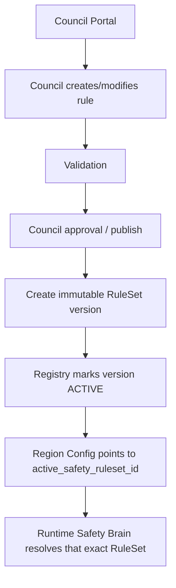
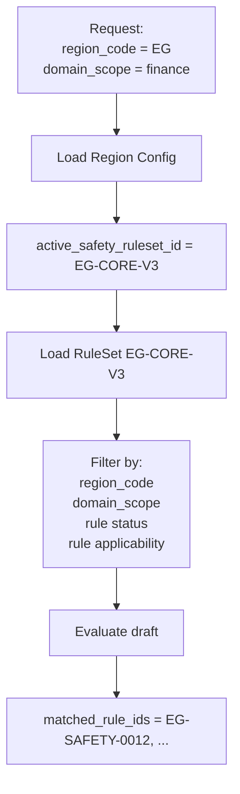
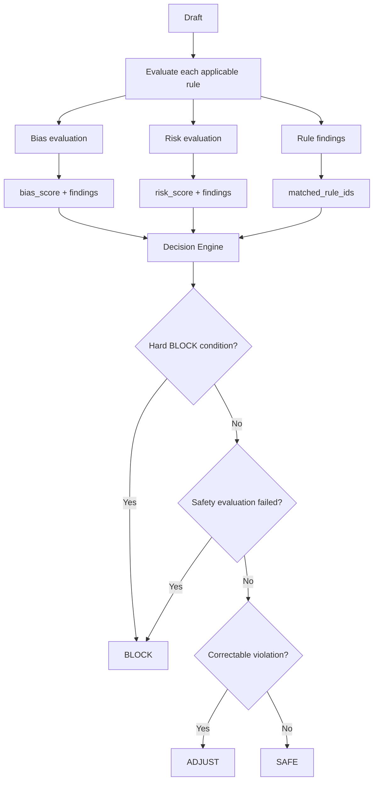
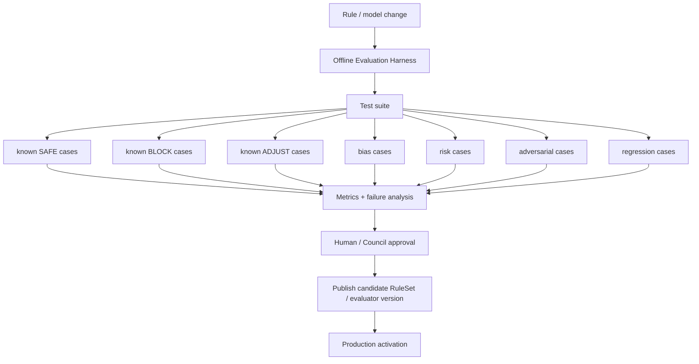
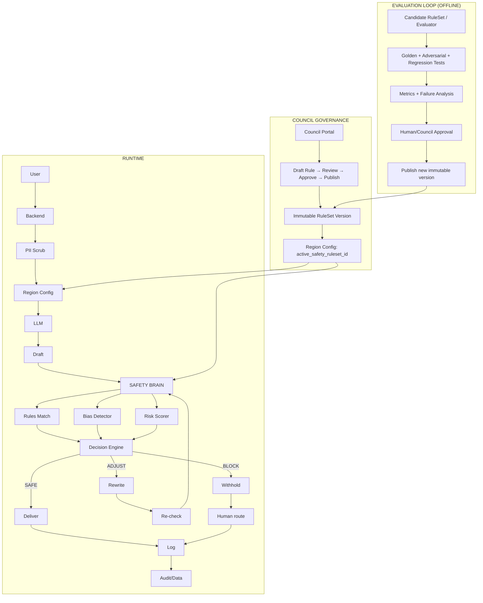

````markdown
# HerAI Safety Brain
Architecture, Governance, Evaluation & Human Oversight

Proposed design document — grounded in the current HerAI architecture and contracts

## 1. Purpose

This document expands the existing HerAI Safety Brain architecture into an implementable design. It explains what the Safety Brain contains, how it evaluates an LLM-generated draft before delivery, how Council governance rules are published and selected, how SAFE/ADJUST/BLOCK decisions are made, how blocked cases can involve a human, and how the system can be tested and evaluated without autonomously changing its own production behavior.

Important distinction: the current architecture documents define the required safety boundary, verdicts, rule traceability, region configuration, and governance concepts. The detailed evaluator orchestration, rule schema below, Council publishing workflow, and evaluation harness are proposed extensions of that architecture, not claims that these implementation details already exist.

## 2. Existing Architecture Baseline

The current system pipeline is: Receive → Scrub → Load Config → Generate → Safety Evaluation → Decide → Log → Respond. The generated draft must remain server-side until Safety Evaluation is complete. The Safety Brain evaluates the draft against active safety rules and returns SAFE, ADJUST, or BLOCK.

```mermaid
flowchart TD
    A[User] --> B[Access Layer]
    B --> C[Backend API]
    C --> D[PII Scrubbing]
    D --> E[Load Region Config]
    E --> F[Advisory Layer / LLM]
    F --> G[Generated Draft]
    G --> H[Safety Brain]

    H --> I{SAFE / ADJUST / BLOCK}

    I -->|SAFE| J[Deliver]
    I -->|ADJUST| K[Rewrite under rule]
    K --> L[Re-check]
    L --> H
    I -->|BLOCK| M[Withhold]
    M --> N[Fallback / Human route]

    J --> O[Log Verdict]
    N --> O
    O --> P[Data Layer]
````

The current safety contract also requires separate bias_score and risk_score values, matched_rule_ids, verdict logging, fail-closed behavior on safety errors/timeouts, no token streaming, and a human-assistance route for BLOCK cases.

## 3. Proposed Safety Brain Internal Architecture

```mermaid
flowchart TD
    A[Governance / Council<br/>Rules + RuleSets + Versions]
    A -->|publish / approve| B[Rules Registry / Store<br/>immutable versions + status]

    B -->|active_safety_ruleset_id| C[Region Config Loader]

    U[User] --> D[Backend Chat]
    D --> C
    C --> E[LLM / AI Service]
    E -->|draft| F[Safety Brain]

    F --> G[Rule Applicability]
    F --> H[Bias Detector]
    F --> I[Risk Scorer]

    G --> J[Decision Engine]
    H --> J
    I --> J

    J -->|SAFE| K[Deliver]
    J -->|ADJUST| L[Rewrite + Re-check]
    J -->|BLOCK| M[Withhold + Human route]

    K --> N[Log]
    L --> F
    M --> N
```

## 4. Components of the Safety Brain

| Component                 | Responsibility                                                           | Production rule                                               |
| ------------------------- | ------------------------------------------------------------------------ | ------------------------------------------------------------- |
| Rules Resolver            | Loads the exact active RuleSet for region + domain.                      | Never silently fall back to an unrelated RuleSet.             |
| Rule Applicability Filter | Determines which rules are relevant to the request/draft.                | Records matched_rule_ids.                                     |
| Bias Detector             | Evaluates bias/stereotype/fairness concerns.                             | Produces bias_score and evidence.                             |
| Risk Scorer               | Evaluates physical, financial, legal, privacy, or other configured risk. | Produces risk_score and evidence.                             |
| Decision Engine           | Maps evaluation evidence + rule severity to SAFE/ADJUST/BLOCK.           | Deterministic policy layer; LLM does not get final authority. |
| Rewrite/Adjuster          | Produces a safer alternative when a rule allows correction.              | Must be re-evaluated before delivery.                         |
| Audit Logger              | Stores verdict, rules, scores, versions, and outcomes.                   | Every verdict is logged.                                      |
| Human Review Router       | Routes eligible BLOCK cases to an approved human workflow.               | Never exposes the blocked draft as the final answer.          |

## 5. Council Portal → Active Safety RuleSet

The current region configuration already contains active_safety_ruleset_id. The proposed governance workflow uses that field as the stable link between a region and the exact version of the safety rules used at runtime.



Recommended lifecycle:

* DRAFT — editable by authorized Council users.
* IN_REVIEW — submitted for review; changes are tracked.
* APPROVED — Council decision recorded.
* PUBLISHED — immutable version available to runtime.
* ACTIVE — selected by a region/domain configuration.
* RETIRED — preserved for audit but no longer selected for new requests.

A published RuleSet should be immutable. If the Council changes a rule, create a new RuleSet version rather than editing the active version in place. This preserves historical traceability.

## 6. Proposed Rule Design

Rules should be written as structured governance objects, not as free-form paragraphs only. The human-readable rule_text remains important, but the Safety Brain also needs stable IDs, scope, severity, action policy, and test cases.

```json
{
  "rule_id": "EG-SAFETY-0012",
  "ruleset_id": "EG-CORE-V3",
  "version": 3,
  "status": "published",
  "region_code": "EG",
  "domain_scope": ["cooperatives", "finance"],
  "rule_type": "financial_risk",
  "title": "No unsupported financial guarantees",
  "rule_text": "Do not guarantee profit, approval, or financial outcome.",
  "severity": "high",
  "decision_policy": {
    "default_action": "adjust",
    "block_conditions": [
      "explicit_guarantee",
      "high_risk_actionable_advice"
    ]
  },
  "applies_to": {
    "input": true,
    "draft": true
  },
  "examples": {
    "violating": [
      "You will definitely make a profit."
    ],
    "compliant": [
      "Potential outcomes vary; review the risks before deciding."
    ]
  },
  "test_case_ids": [
    "TC-EG-FIN-001",
    "TC-EG-FIN-002"
  ],
  "created_by": "council_user_id",
  "approved_at": "timestamp"
}
```

## 7. Rule Authoring Principles

* One rule should express one clear safety obligation whenever possible.
* Rules should be testable: a reviewer should be able to construct violating and compliant examples.
* Use stable rule_id values; never reuse an ID for a different policy meaning.
* Separate scope (where the rule applies) from severity (how serious a violation is).
* Define whether a violation is normally SAFE, ADJUST, or BLOCK, while allowing the decision engine to apply hard constraints.
* Include examples and counterexamples to reduce ambiguity for evaluators.
* Keep rules region- and domain-aware through region_code and domain_scope.
* Do not put secrets, credentials, or personal data into rules.
* Require Council approval before a rule can become ACTIVE.

## 8. How the Safety Brain Selects Rules



The Safety Brain should never retrieve an arbitrary latest rule. It should resolve the exact active RuleSet version specified by region configuration, then apply only rules valid for the request's domain and scope.

## 9. Evaluation and Decision Logic

The LLM can assist with classification and evidence extraction, but the final safety action should be controlled by a deterministic policy layer. This prevents the model from deciding on its own that a dangerous response is acceptable.



Thresholds and hard-block conditions should be configuration-driven and versioned. The exact numeric thresholds are not defined in the current architecture documents and should therefore be agreed as part of implementation and Council governance.

## 10. ADJUST Flow

```mermaid
flowchart TD
    A[Draft] --> B[Safety Brain]
    B --> C[ADJUST]
    C --> D[Identify matched rule(s)]
    D --> E[Rewrite under rule instruction]
    E --> F[Re-check full Safety Brain]

    F -->|SAFE| G[Deliver]
    F -->|ADJUST| H[Apply bounded retry policy]
    H --> B
    F -->|BLOCK| I[Withhold + log + human route if eligible]
```

The current contract explicitly requires a re-check after an ADJUST. A practical implementation should also define a maximum retry count to avoid loops; the exact number is a proposed implementation parameter, not a current contract value.

## 11. BLOCK + Human Intervention

A BLOCK must not expose the blocked draft. The system should instead return an approved fallback and, where the policy allows, offer a human-assistance route.

```mermaid
flowchart TD
    A[Safety Brain] --> B[BLOCK]

    B --> C[Log full safety decision]
    B --> D[Store matched_rule_ids + rule version]
    B --> E[Create Human Review Case<br/>(if eligible)]
    B --> F[User receives safe fallback:<br/>"This request needs human review."]

    E --> G[Council / approved reviewer]
    G --> H[Review original user request]

    H --> I{Human decision}
    I -->|Approve/answer| J[Human response]
    I -->|Keep blocked| K[Final fallback]

    J --> L[Audit trail]
    K --> L
```

Human review should be based on an approved access-control model. Reviewers should see the minimum information required, and all human decisions should be logged with reviewer identity, timestamp, reason, and resulting disposition.

## 12. Council Portal Workflow

| Step | Council action                 | System result                                          |
| ---- | ------------------------------ | ------------------------------------------------------ |
| 1    | Create draft rule              | Rule gets stable ID and DRAFT status.                  |
| 2    | Define scope/severity/examples | Rule becomes machine-testable.                         |
| 3    | Submit for review              | Rule enters IN_REVIEW.                                 |
| 4    | Council approves               | Approval decision is recorded.                         |
| 5    | Publish RuleSet                | Immutable RuleSet version created.                     |
| 6    | Activate for region/domain     | Region config points to ruleset ID.                    |
| 7    | Runtime use                    | Safety Brain resolves exact active version.            |
| 8    | Later change                   | New version is created; old version remains auditable. |

## 13. Self-Testing: What the Safety Brain Should and Should Not Do

The Safety Brain should not autonomously retrain or rewrite its own production safety policy. Instead, it should have a separate evaluation harness that continuously tests candidate rules, evaluator prompts/models, and decision policies against a versioned dataset.



## 14. Evaluation Dataset

| Dataset class | Purpose                                                       | Expected label               |
| ------------- | ------------------------------------------------------------- | ---------------------------- |
| SAFE          | Confirm benign answers remain deliverable.                    | SAFE                         |
| ADJUST        | Confirm correctable violations are rewritten.                 | ADJUST → SAFE after re-check |
| BLOCK         | Confirm dangerous or prohibited outputs are withheld.         | BLOCK                        |
| Bias          | Test stereotypes, discrimination, and capability assumptions. | Policy-dependent             |
| Risk          | Test physical/financial/operational risk.                     | Policy-dependent             |
| Regional      | Confirm rules differ correctly by region.                     | Region-specific              |
| Domain        | Confirm domain-specific rules are selected.                   | Domain-specific              |
| Adversarial   | Test attempts to bypass safety rules.                         | BLOCK or policy-specific     |
| Regression    | Prevent previously fixed failures from returning.             | Expected historical result   |

## 15. Metrics for Safety Evaluation

* False Safe: unsafe content incorrectly allowed — highest-priority safety failure.
* False Block: safe content incorrectly blocked — important for usability and fairness.
* False Adjust: content unnecessarily rewritten.
* Rule coverage: percentage of applicable rules represented by test cases.
* Matched-rule accuracy: whether the recorded matched_rule_ids explain the decision.
* Regional correctness: whether the correct region RuleSet was used.
* Regression rate: previously passing cases that fail after a change.
* Human-review agreement: agreement between system decision and approved human review outcomes.

## 16. Testing Gates Before a RuleSet Becomes ACTIVE

1. Schema validation: every rule contains required fields and valid scopes.
2. Rule linting: detect ambiguous, contradictory, or duplicate rules.
3. Unit tests: test RuleSet selection and decision-engine behavior.
4. Golden-set evaluation: run approved labeled cases.
5. Adversarial evaluation: attempt to trigger unsafe outputs or bypass instructions.
6. Regression evaluation: compare against the previous active version.
7. Human review: Council/authorized reviewer approves the candidate.
8. Publish immutable RuleSet version.
9. Activate by region configuration.
10. Monitor production verdicts and route unexpected patterns back to governance.

## 17. Versioning and Auditability

Every verdict should record enough information to reproduce the governance context that produced it.

| Audit field                  | Why it matters                                  |
| ---------------------------- | ----------------------------------------------- |
| ruleset_id / ruleset_version | Identifies exact safety policy.                 |
| region_config_version        | Identifies regional configuration.              |
| matched_rule_ids             | Explains which rules affected the decision.     |
| bias_score                   | Preserves bias evaluation result.               |
| risk_score                   | Preserves risk evaluation result.               |
| action                       | SAFE / ADJUST / BLOCK.                          |
| draft_response               | What was evaluated (subject to privacy policy). |
| final_response               | What was delivered, if any.                     |
| timestamp                    | When the decision occurred.                     |
| human_review_id              | Links a human intervention when applicable.     |

## 18. Security and Privacy Boundaries

* Raw user text must be scrubbed before database persistence according to the existing architecture.
* The unverified draft remains server-side and is never sent to the frontend.
* Council Portal actions require role-based authorization.
* Only approved Council users can publish/activate rules.
* Human reviewers receive only the minimum data needed for review.
* Secrets and provider credentials remain outside rule definitions and source control.
* All rule changes and human decisions are auditable.

## 19. Proposed End-to-End Example

1. User asks: "هل أضمن أن المشروع سيحقق ربحاً؟"
2. Backend receives region_code=EG, domain_scope=finance.
3. Backend loads region_config.EG and active_safety_ruleset_id=EG-CORE-V3.
4. Advisory layer asks GPT for a draft.
5. GPT returns a draft that contains a financial guarantee.
6. Safety Brain loads applicable financial-risk rules.
7. Risk Scorer flags the guarantee; matched_rule_ids includes EG-SAFETY-0012.
8. Decision Engine selects ADJUST because the rule allows correction.
9. Rewrite step produces a cautious, non-guaranteeing answer.
10. Safety Brain re-checks the rewritten answer.
11. If SAFE → deliver and log.
12. If still unsafe and hard-block condition is met → BLOCK.
13. For BLOCK → return approved fallback and create human-review case if policy permits.
14. Human reviewer can resolve the case; the human decision is logged.
15. If the Council later changes the rule, a new RuleSet version is published.
16. Future requests use the new active version; historical verdicts retain the old version.

## 20. Recommended MVP Scope

To keep the first implementation manageable, the MVP should avoid trying to build an autonomous self-learning Safety Brain. The first version should establish a deterministic, auditable safety pipeline with versioned Council rules.

* RuleSet + Rule schema and versioning.
* Council create/review/approve/publish workflow.
* Region → active_safety_ruleset_id resolution.
* Safety Brain orchestration service.
* Separate bias_score and risk_score outputs.
* Deterministic SAFE/ADJUST/BLOCK decision engine.
* ADJUST → rewrite → full re-check.
* BLOCK → safe fallback + optional human-review case.
* Full verdict and rule traceability logging.
* Offline evaluation harness with golden, adversarial, and regression datasets.
* No automatic production self-training; all policy changes go through evaluation and human/Council approval.

## 21. Open Decisions Required Before Implementation

| Decision                          | Why it must be agreed                                                |
| --------------------------------- | -------------------------------------------------------------------- |
| Exact bias/risk thresholds        | Current contracts define separate scores but not numeric thresholds. |
| Hard-block categories             | Must be explicit so the decision engine is deterministic.            |
| Rule priority/conflict resolution | Needed when multiple rules apply or conflict.                        |
| Maximum ADJUST retries            | Needed to prevent rewrite loops.                                     |
| Human-review eligibility          | Not every BLOCK necessarily needs the same escalation path.          |
| Council roles                     | Define author, reviewer, approver, publisher permissions.            |
| Retention/privacy for drafts      | Auditability must be balanced with PII/privacy constraints.          |
| Evaluator model/provider          | Must remain behind ai.service.ts and be provider-independent.        |
| Production monitoring thresholds  | Define when unexpected safety patterns trigger review.               |

## 22. Relationship to the Existing HerAI Documents

This document is an extension of the existing System Architecture, Safety Contract, Architecture Rules, Region Configuration, and Data Model. It preserves their core requirements: server-side safety evaluation, SAFE/ADJUST/BLOCK, fail-closed behavior, separate bias/risk scores, matched_rule_ids, region-aware configuration, versioned traceability, no token streaming, and a human route for BLOCK cases. The detailed RuleSet schema, Council publishing lifecycle, evaluation harness, and deterministic decision-engine design are proposed implementation details to be reviewed and accepted before coding.

## 23. Summary Architecture



## 24. Key Principle

The Safety Brain should not be an autonomous second LLM that simply says “safe” or “unsafe.” It should be an auditable control layer: versioned Council rules + structured evaluation + deterministic decision policy + re-checking + human escalation + complete traceability.

```
```
