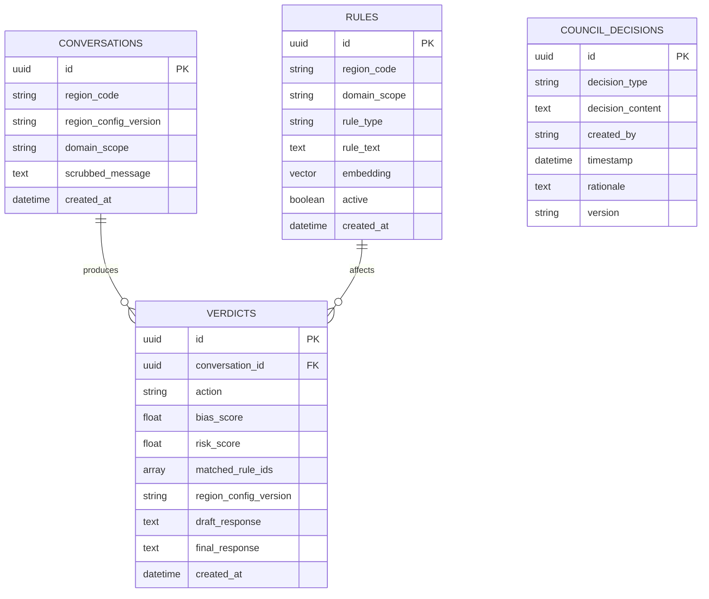

# HerAI Data Model

## 1. Purpose

This document defines the core data model used by the HerAI system.

It acts as the data contract between the application services and the
database.

The database implementation must follow this model.

---

## 2. Core Entities

The initial system contains four core entities:

- Rules
- Conversations
- Verdicts
- Council Decisions

---

## 3. Entity Relationship Overview



# 4. Conversations

The `conversations` entity stores the minimum information required to
track a user interaction.

### Fields

| Field | Type | Description |
|---|---|---|
| `id` | UUID | Unique conversation identifier |
| `region_code` | string | Region associated with the request |
| `domain_scope` | string | Domain of the request |
| `scrubbed_message` | text | User message after PII removal |
| `created_at` | datetime | Creation timestamp |

### Privacy Rule

The database must store the scrubbed message.

Raw user text must not be persisted.

PII scrubbing must happen before the first database write.

---

# 5. Verdicts

The `verdicts` entity stores the result of the Safety Brain evaluation.

### Fields

| Field | Type | Description |
|---|---|---|
| `id` | UUID | Unique verdict identifier |
| `conversation_id` | UUID | Related conversation |
| `verdict` | string | SAFE, ADJUST, or BLOCK |
| `bias_score` | float | Bias evaluation score |
| `risk_score` | float | Risk evaluation score |
| `matched_rule_ids` | array | Rules matched during evaluation |
| `region_config_version` | string | Configuration version used |
| `draft_response` | text | Generated draft evaluated by Safety Brain |
| `final_response` | text | Final response after safety processing |
| `created_at` | datetime | Verdict timestamp |

### Verdict Values

```text
SAFE
ADJUST
BLOCK
```

Every Safety Verdict must be logged, including SAFE verdicts.

---

# 6. Rules

The `rules` entity stores the active safety and governance rules used by
the Safety Brain.

### Fields

| Field | Type | Description |
|---|---|---|
| `id` | UUID | Unique rule identifier |
| `region_code` | string | Region where the rule applies |
| `domain_scope` | string | Domain where the rule applies |
| `rule_type` | string | Type of governance or safety rule |
| `rule_text` | text | Rule definition |
| `active` | boolean | Whether the rule is currently active |
| `created_at` | datetime | Creation timestamp |

Rules are selected according to the applicable region and domain.

---

# 7. Council Decisions

The `council_decisions` entity stores governance decisions made by the
Council.

### Fields

| Field | Type | Description |
|---|---|---|
| `id` | UUID | Unique decision identifier |
| `decision_type` | string | Type of Council decision |
| `decision_content` | text | Decision details |
| `version` | string | Decision version |
| `created_at` | datetime | Decision timestamp |

Council decisions can result in changes to the active governance rules.

---

# 8. Important Relationships

### Conversation → Verdict

One conversation can produce multiple verdict records.

This supports cases where a response is adjusted and evaluated again.

```text
Conversation
     │
     ├── Verdict 1 → ADJUST
     │
     └── Verdict 2 → SAFE
```

---

### Rule → Verdict

A verdict can reference the rules that affected the Safety Evaluation.

The `matched_rule_ids` field provides traceability.

---

### Council Decision → Rule

Council decisions can result in the creation or modification of
governance rules.

---

# 9. Auditability

A Safety Verdict must be explainable after the fact.

The system should retain:

- Verdict
- Matched rule IDs
- Bias score
- Risk score
- Region configuration version
- Draft response
- Final response
- Timestamp

This allows the team to understand which configuration and rules were
active when a decision was made.

---

# 10. Architectural Data Rules

1. Raw user text must not be persisted.
2. PII must be scrubbed before the first database write.
3. Every Safety Verdict must be logged.
4. SAFE verdicts must also be logged.
5. Every Verdict must store the `region_config_version`.
6. `matched_rule_ids` must be stored for traceability.
7. Bias and risk scores must remain separate fields.
8. Database access must be performed through the backend.
9. The frontend must never access the database directly.
