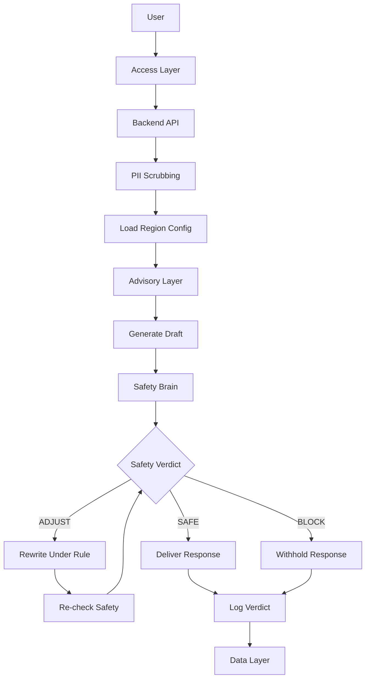
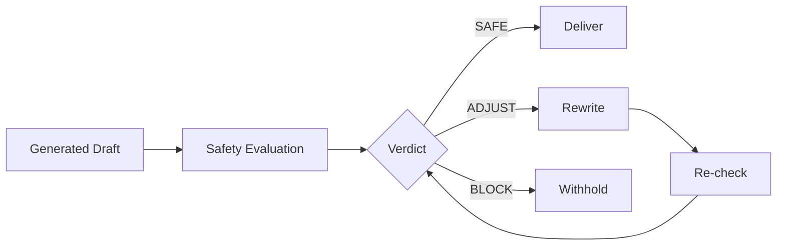
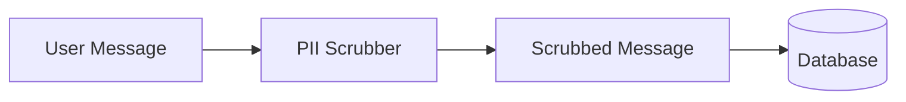
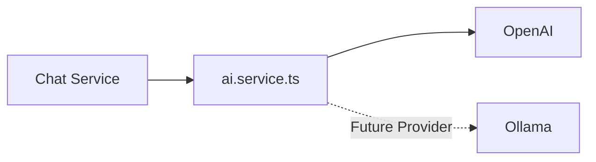
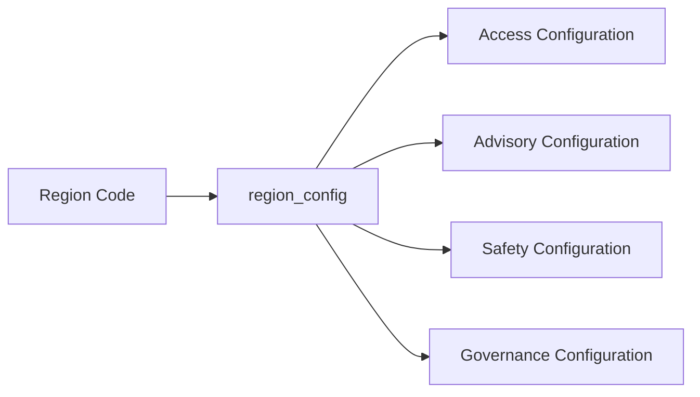

# HerAI System Architecture

## 1. Overview

HerAI follows a layered architecture where the user request passes through
controlled processing stages before a response is delivered.

The main request pipeline is:

Receive → Scrub → Load Config → Generate → Safety Evaluation → Decide → Log → Respond

---

## 2. Request Flow

---

## 3. Main Layers

### Access Layer

Responsible for receiving user requests through the available user-facing channels.

### Advisory Layer

Responsible for generating the conversational draft using the configured
knowledge domain, persona, language, and dialect.

### Safety Brain

Responsible for evaluating the generated draft against the active safety
rules and producing a safety verdict.

Possible verdicts:

- SAFE
- ADJUST
- BLOCK

### Governance Layer

Responsible for defining and versioning the rules and configuration that
control the system behavior.

### Data Layer

Responsible for storing the required scrubbed data, conversations, rules,
verdicts, and governance records.

---

## 4. Safety Flow

The generated draft must not be delivered directly to the user.

The draft must first pass through the Safety Brain.

If the Safety Evaluation fails or times out, the response must be blocked
rather than delivering an unverified draft.

---

## 5. Data Privacy Boundary

PII must be removed before the first database write.

Raw user text must not be stored in the database.

---

## 6. AI Provider Boundary

All model access must pass through the centralized AI service.

No other service should call the provider SDK directly.

This keeps the application independent from a specific AI provider.

---

## 7. Region Configuration

The system uses region-specific configuration.

At runtime, the system resolves the configuration for the active region.

Each layer reads only the configuration fields relevant to its responsibility.

---

## 8. Architectural Principle

The system should keep the core architecture shared across regions while
allowing region-specific behavior through configuration.

Adding a new region should primarily be a configuration change rather than
a rewrite of the core system.
