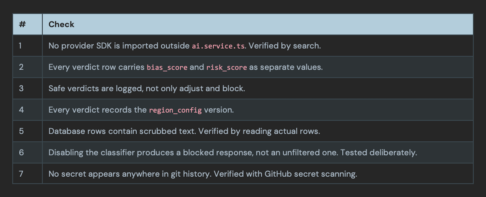
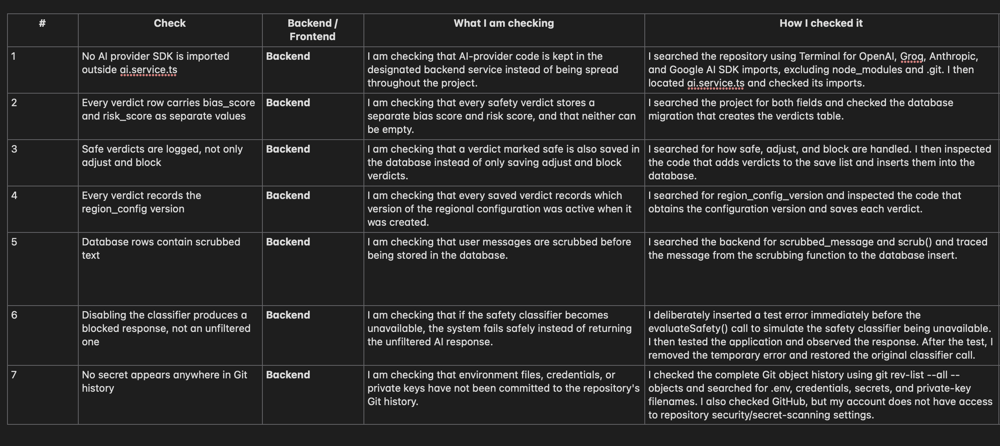
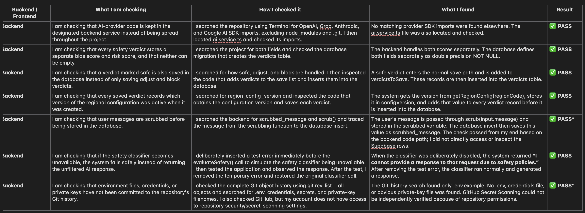
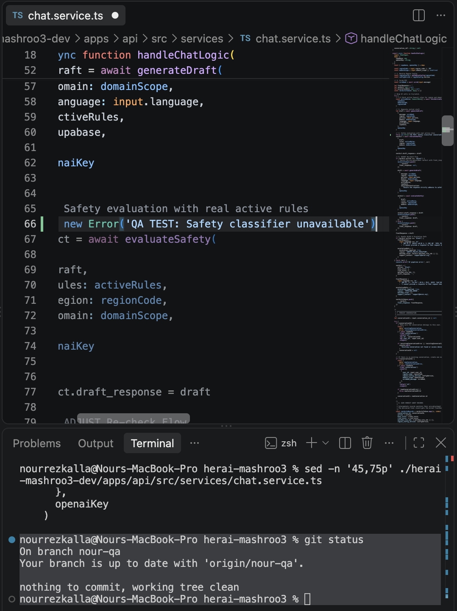
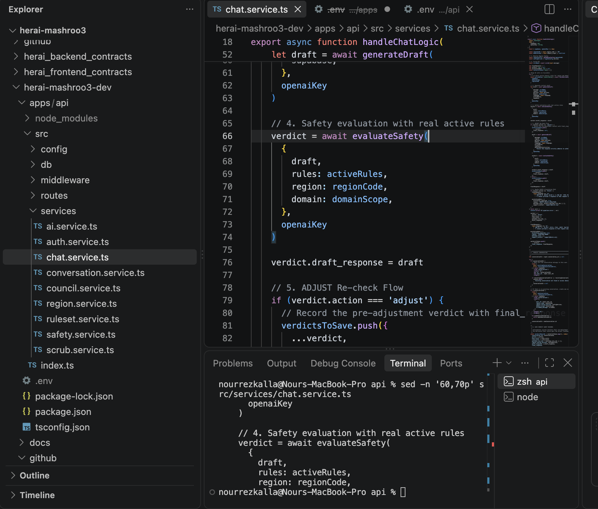

7 checks for the backend, all PASSED ✅
Introduction

This document represents the final version of the backend QA testing for the HerAI project. During the earlier stages of testing, before the system reached its final working state, a few fixable issues were identified. The main issue involved response caching, while additional verification was required around the authentication and AI chat flow.

The earlier testing focused on confirming that account creation and login were working sufficiently to reach the real AI system. It also identified areas that needed to be verified, including whether the frontend correctly saved and sent the user's authentication token, whether /api/chat consistently recognized the logged-in user, whether the AI received and used the correct Egypt/region, domain, persona, and Council Rules context, and whether conversations and their responses were correctly saved and loaded.

These issues were addressed and fixed during development and QA. The system was then retested, including verification of the backend safety and Council pipeline. Following these fixes and the final verification, all seven backend QA checks passed successfully.

The purpose of this document is therefore to record the final verified state of the backend, including the checks performed, the methods used to verify them, the evidence obtained, and the final results.

7 checks table below:

## Master QA Table — Final Backend Verification

Note:
* Checks 5 and 7 passed based on the verification available from my side. Check 5 was not directly verified against the Supabase database rows, and Check 7 could not be independently verified through GitHub Secret Scanning because the repository settings were not accessible to my account.

Check 6 — Detailed Verification
Check 6: Disabling the Classifier Produces a Blocked Response

Layer: Backend
Result: ✅ PASS

The purpose of this check was to verify that the HerAI backend follows a fail-closed safety behavior. In other words, if the safety classifier becomes unavailable, the system must not return the AI-generated response without safety evaluation.

Normally, the backend generates an initial response and then passes that response to the safety classifier through:

verdict = await evaluateSafety(
  {
    draft,
    rules: activeRules,
    region: regionCode,
    domain: domainScope,
  },
  openaiKey
)

The evaluateSafety() function is responsible for evaluating the generated draft and returning a verdict of:

safe
adjust
block

The returned verdict is then used by the chat service to determine how the response should be handled.

Deliberate Failure Test

To test what happens when the classifier is unavailable, a temporary error was deliberately inserted immediately before the classifier call:

throw new Error('QA TEST: Safety classifier unavailable')

This was only a QA test line and was not intended to remain in the application.

The purpose of inserting this error was to simulate a situation where the safety classifier fails or becomes unavailable.

Observed Result

After running the application and submitting a request, the backend generated the following error in the API terminal:

AI pipeline error: Error: QA TEST: Safety classifier unavailable

The user-facing application did not return the original, unfiltered AI-generated response.

Instead, it returned:

“I cannot provide a response to that request due to safety policies.”

This demonstrates that when the safety evaluation step is deliberately made unavailable, the application follows its safety fallback behavior rather than allowing an unchecked response to reach the user.

Restoration After Testing

After confirming the behavior, the temporary QA error was removed.

The original classifier call was restored:

verdict = await evaluateSafety(
  {
    draft,
    rules: activeRules,
    region: regionCode,
    domain: domainScope,
  },
  openaiKey
)

The application was then tested again, and the safety classifier operated normally and produced a response.

What evaluateSafety() Does

evaluateSafety() is the backend function responsible for evaluating an AI-generated draft before it is delivered.

It provides the classifier with:

The generated draft response
Active Council safety rules
The applicable region
The applicable domain

The classifier then determines whether the response is:

Safe → allowed to continue.

Adjust → the response needs modification and is regenerated/rechecked.

Block → the response is considered unsafe and is replaced with a safety-policy message.

The function also produces:

bias_score
risk_score
matched_rule_ids

This means the classifier is not simply generating a response; it is acting as a safety gate between the generated response and the user.

Why This Check Passed

The deliberate failure test demonstrated that:

AI generation → Safety classifier → User

does not become:

AI generation → User

when the classifier fails.

Instead, the system follows the safer behavior:

AI generation → Classifier unavailable → Blocked safety response

Therefore, the system successfully demonstrates fail-closed behavior for the safety classifier.

The temporary throw new Error(...) was only introduced for testing and was removed afterward. It is not a permanent addition to the application.

Line 66 with error code embedded:

After removing the error line of code: 

Conclusion
Final QA Conclusion

All seven QA checks were completed successfully from the available verification points. The backend safety pipeline, verdict logging, regional configuration tracking, message scrubbing, classifier fail-closed behavior, and Git-history checks all produced the expected results.

The temporary code introduced for Check 6 was removed after testing, and the normal evaluateSafety() flow was restored. The application was also successfully started with the required backend environment configuration, and authentication was tested successfully.

Overall, the tested functionality is behaving as expected and all checks are marked PASS, with the noted limitation that direct Supabase row inspection and GitHub Secret Scanning could not be independently performed from the available account access.
